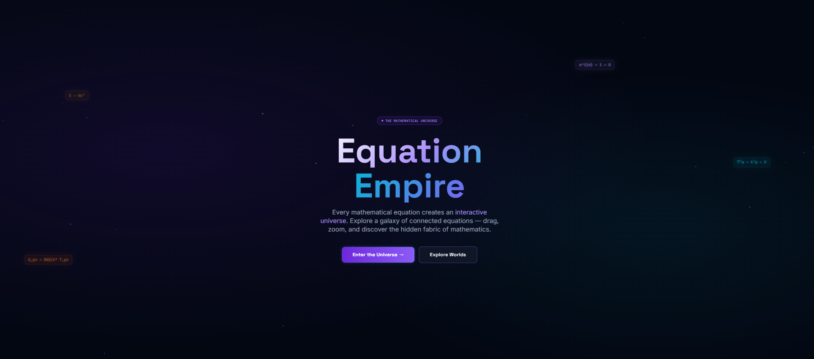
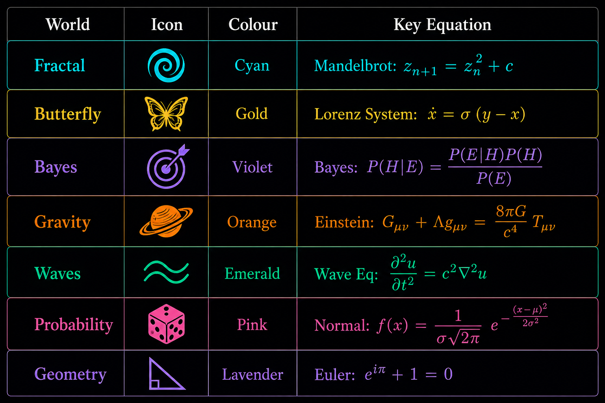

# 🌌 Equation Empire

> Every mathematical equation creates an interactive universe.

A stunning interactive exploration of mathematical equations — built with Next.js 15, React Flow, Framer Motion, and Tailwind CSS.

  

## ✨ Features

- **Interactive graph universe** — Drag, zoom, and pan through connected equation nodes
- **7 mathematical worlds** — Fractal, Butterfly, Bayes, Gravity, Waves, Probability, Geometry
- **42 equation nodes** — Each with title, equation, description, tags, and category
- **Animated star-field** — Canvas-based procedural star field with parallax motion
- **Futuristic dark-space theme** — Custom design tokens, glow effects, and micro-animations
- **World selector sidebar** — Filter the universe to a single world with animated transitions
- **Node detail panel** — Click any node for an expanded information overlay
- **Responsive design** — Accessible and responsive down to mobile

---

## 🌍 The 7 Worlds

  

---

## 📦 Tech Stack

| Tool | Version | Purpose |
|------|---------|---------|
| Next.js | 15 | Framework, App Router |
| TypeScript | 5 | Type safety |
| Tailwind CSS | 3 | Utility styling |
| @xyflow/react | 12 | Interactive graph (React Flow) |
| Framer Motion | 12 | Animations & transitions |

---

## 🎨 Design System

**Fonts**
- `Space Grotesk` — Display / headings (geometric, futuristic)
- `JetBrains Mono` — Equations, code, tags
- `Inter` — Body copy

**Signature element**: Procedural canvas star-field with velocity-based depth rendering, giving the universe a genuine sense of 3D depth as stars streak toward the viewer.

---

*Built with curiosity and caffeine. May contain trace amounts of beauty.*
